# [JavaScript basic - Exercises, Practice, Solution](https://www.w3resource.com/javascript-exercises/javascript-basic-exercises.php)
## JavaScript basic [150 exercises with solution]

1. Write a JavaScript program to display the current day and time in the following format.
> Sample Output : Today is : Tuesday.  
> Current time is : 10 PM : 30 : 38

2. Write a JavaScript program to print the contents of the current window.

3. Write a JavaScript program to get the current date.
> Expected Output :   
> mm-dd-yyyy, mm/dd/yyyy or dd-mm-yyyy, dd/mm/yyyy

4. Write a JavaScript program to find the area of a triangle where lengths of the three of its sides are 5, 6, 7.

5. Write a JavaScript program to rotate the string 'w3resource' in right direction by periodically removing one letter from the end of the string and attaching it to the front.

6. Write a JavaScript program to determine whether a given year is a leap year in the Gregorian calendar.

7. Write a JavaScript program to find 1st January is being a Sunday between 2014 and 2050.

8. Write a JavaScript program where the program takes a random integer between 1 to 10, the user is then prompted to input a guess number. If the user input matches with guess number, the program will display a message "Good Work" otherwise display a message "Not matched".

9. Write a JavaScript program to calculate days left until next Christmas.

10. Write a JavaScript program to calculate multiplication and division of two numbers (input from user).

11. Write a JavaScript program to convert temperatures to and from Celsius, Fahrenheit.
> [ Formula : c/5 = (f-32)/9 [ where c = temperature in Celsius and f = temperature in Fahrenheit ]   
> Expected Output :  
> 60°C is 140 °F
> 45°F is 7.222222222222222°C 

12. Write a JavaScript program to get the website URL (loading page).

13. Write a JavaScript exercise to create a variable using a user-defined name.

14. Write a JavaScript exercise to get the extension of a filename.

15. Write a JavaScript program to get the difference between a given number and 13, if the number is greater than 13 return double the absolute difference.

16. Write a JavaScript program to compute the sum of the two given integers. If the two values are same, then returns triple their sum.

17. Write a JavaScript program to compute the absolute difference between a specified number and 19. Returns triple their absolute difference if the specified number is greater than 19.

18. Write a JavaScript program to check two given numbers and return true if one of the number is 50 or if their sum is 50.

19. Write a JavaScript program to check a given integer is within 20 of 100 or 400.

20. Write a JavaScript program to check from two given integers, if one is positive and one is negative.

21. Write a JavaScript program to create a new string adding "Py" in front of a given string. If the given string begins with "Py" then return the original string.

22. Write a JavaScript program to remove a character at the specified position of a given string and return the new string.

23. Write a JavaScript program to create a new string from a given string changing the position of first and last characters. The string length must be greater than or equal to 1.

24. Write a JavaScript program to create a new string from a given string with the first character of the given string added at the front and back.

25. Write a JavaScript program check if a given positive number is a multiple of 3 or a multiple of 7.

26. Write a JavaScript program to create a new string from a given string taking the last 3 characters and added at both the front and back. The string length must be 3 or more.

27. Write a JavaScript program to check if a string starts with 'Java' and false otherwise.

28. Write a JavaScript program to check if two given integer values are in the range 50..99 (inclusive). Return true if either of them are in the said range.

29. Write a JavaScript program to check if three given integer values are in the range 50..99 (inclusive). Return true if one or more of them are in the said range.

30. Write a JavaScript program to check if a string "Script" presents at 5th (index 4) position in a given string, if "Script" presents in the string return the string without "Script" otherwise return the original one.

31. Write a JavaScript program to find the largest of three given integers.

32. Write a JavaScript program to find a value which is nearest to 100 from two different given integer values.

33. Write a JavaScript program to check if two numbers are in range 40..60 or in the range 70..100 inclusive.

34. Write a JavaScript program to find the larger number from the two given positive integers, the two numbers are in the range 40..60 inclusive.

35. Write a JavaScript program to check a given string contains 2 to 4 numbers of a specified character.

36. Write a JavaScript program to check if the last digit of the three given positive integers is same.

37. Write a JavaScript program to create new string with first 3 characters are in lower case. If the string length is less than 3 convert all the characters in upper case.

38. Write a JavaScript program to check the total marks of a student in various examinations. The student will get A+ grade if the total marks are in the range 89..100 inclusive, if the examination is "Final-exam." the student will get A+ grade and total marks must be greater than or equal to 90. Return true if the student get A+ grade or false otherwise.

39. Write a JavaScript program to compute the sum of the two given integers, If the sum is in the range 50..80 return 65 other wise return 80.

40. Write a JavaScript program to check from two given integers if either one is 8 or their sum or difference is 8.

41. Write a JavaScript program to check three given numbers, if the three numbers are same return 30 otherwise return 40 and if two numbers are same return 20.

42. Write a JavaScript program to check if three given numbers (integers) are increasing in strict mode and flag is "false", however if "true" is false the numbers will in soft mode.
Note: Strict mode -> 10, 15, 31 : Soft mode -> 24, 22, 31 or 22, 22, 31 

43. Write a JavaScript program to check from three given numbers (non negative integers) that two or all of them have the same rightmost digit.

44. Write a JavaScript program to check from three given integers that if a number is greater than or equal to 20 and less than one of the others.

45. Write a JavaScript program to check two given integer values and return true if one of the number is 15 or if their sum or difference is 15.

46. Write a JavaScript program to check two given non-negative integers and if one of the number (not both) is multiple of 7 or 11.

47. Write a JavaScript program to check if a number in the range 40..10000 inclusive presents in two number (in same range).
For example 40 presents in 400 and 4000

48. Write a JavaScript program to reverse a given string.

49. Write a JavaScript program to replace every character in a given string with the character following it in the alphabet.

50. Write a JavaScript program to capitalize the first letter of each word of a given string.

51. Write a JavaScript program to convert a given number to hours and minutes.

52. Write a JavaScript program to convert the letters of a given string in alphabetical order.

53. Write a JavaScript program to check if the characters a and b are separated by exactly 3 places anywhere (at least once) in a given string.

54. Write a JavaScript program to count the number of vowels in a given string.

55. Write a JavaScript program to check if a given string contains equal number of p's and t's present.

56. Write a JavaScript program to divide two positive numbers and return a string with properly formatted commas.

57. Write a JavaScript program to create a new string of specified copies (positive number) of a given string.  
  

58. Write a JavaScript program to create a new string of 4 copies of the last 3 characters of a given original string. The length of the given string must be 3 and above.

59. Write a JavaScript program to extract the first half of a string of even length.

60. Write a JavaScript program to create a new string without the first and last character of a given string.

61. Write a JavaScript program to concatenate two strings except their first character.

62. Write a JavaScript program to move last three character to the start of a given string. The string length must be greater or equal to three.

63. Write a JavaScript program to create a string using the middle three characters of a given string of odd length. The string length must be greater or equal to three.

64. Write a JavaScript program to concatenate two strings and return the result. If the length of the strings are not same then remove the characters from the longer string.

65. Write a JavaScript program to test if a string end with "Script". The string length must be greater or equal to 6.

66. Write a JavaScript program to display the city name if the string begins with "Los" or "New" otherwise return blank.

67. Write a JavaScript program to create a new string from a given string, removing the first and last characters of the string if the first or last character are 'P'. Return the original string if the condition is not satisfied.

68. Write a JavaScript program to create a new string using the first and last n characters from a given sting. The string length must be greater or equal to n.

69. Write a JavaScript program to compute the sum of three elements of a given array of integers of length 3.

70. Write a JavaScript program to rotate the elements left of a given array of integers of length 3. 
  

71. Write a JavaScript program to check if 1 appears in first or last position of a given array of integers. The array length must be greater or equal to 1.  
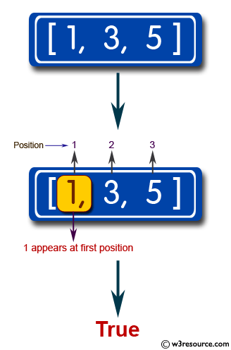  

72. Write a JavaScript program to check if the first and last elements are equal of a given array of integers length 3.

73. Write a JavaScript program to reverse the elements of a given array of integers length 3.

74. Write a JavaScript program to find the larger value between the first or last and set all the other elements with that value. Display the new array.

75. Write a JavaScript program to create a new array taking the middle elements of the two arrays of integer and each length 3.  
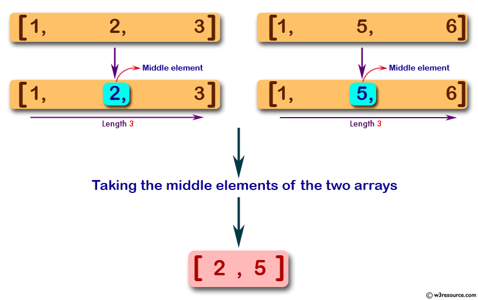  

76. Write a JavaScript program to create a new array taking the first and last elements from a given array of integers and length must be greater or equal to 1.

77. Write a JavaScript program to test if an array of integers of length 2 contains 1 or a 3.

78. Write a JavaScript program to test if an array of integers of length 2 does not contain 1 or a 3.

79. Write a JavaScript program to test if a given array of integers contains 30 and 40 twice. The array length should be 0, 1, or 2.  
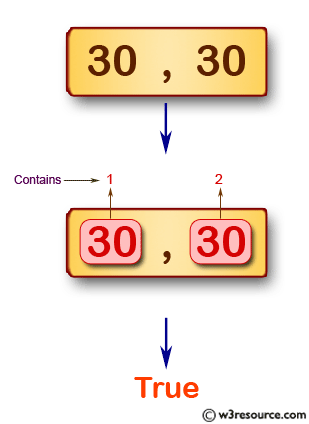  

80. Write a JavaScript program to swap the first and last elements of a given array of integers. The array length should be at least 1.

81. Write a JavaScript program to add two digits of a given positive integer of length two.  
  

82. Write a JavaScript to add two positive integers without carry.  
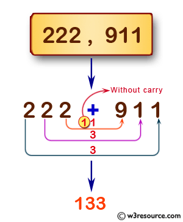  

83. Write a JavaScript to find the longest string from an given array of strings.  
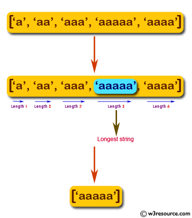  

84. Write a JavaScript to replace each character of a given string by the next one in the English alphabet.
Note: 'a' will be replace by 'b' or 'z' would be replaced by 'a'.

85. Write a JavaScript code to divide an given array of positive integers into two parts. First element goes to first part, second element goes to second part, and third element goes to first part and so on. Now compute the sum of two parts and store into an array of size two.  
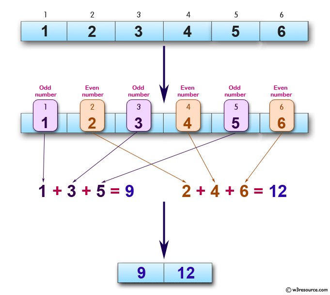  

86. Write a JavaScript program to find the types of a given angle.
> Types of angles:  
+ Acute angle: An angle between 0 and 90 degrees.
+ Right angle: An 90 degree angle.
+ Obtuse angle: An angle between 90 and 180 degrees.
+ Straight angle: A 180 degree angle.

87. Write a JavaScript program to check whether two arrays of integers of same length are similar or not. The arrays will be similar if one array can be obtained from another array by swapping at most one pair of elements.

88. Write a JavaScript program to check whether two given integers are similar or not, if a given divisor divides both integers and it does not divide either.

89. Write a JavaScript program to check whether two given integers are similar or not, if a given divisor divides both integers and it does not divide either.  
> `` For example x = 10, y = 30 and z = 300, we can replace $ with a multiple operator (*) to obtain x * y = z``

90. Write a JavaScript program to find the kth greatest element of a given array of integers

91. Write a JavaScript program to find the maximum possible sum of some of its k consecutive numbers (numbers that follow each other in order.) of a given array of positive integers.

92. Write a JavaScript program to find the maximal difference between any two adjacent elements of a given array of integers.

93. Write a JavaScript program to find the maximal difference among all possible pairs of a given array of integers.

94. Write a JavaScript program to find the number which appears most in a given array of integers.

95. Write a JavaScript program to replace all the numbers with a specified number of a given array of integers.

96. Write a JavaScript program to compute the sum of absolute differences of consecutive numbers of a given array of integers.  
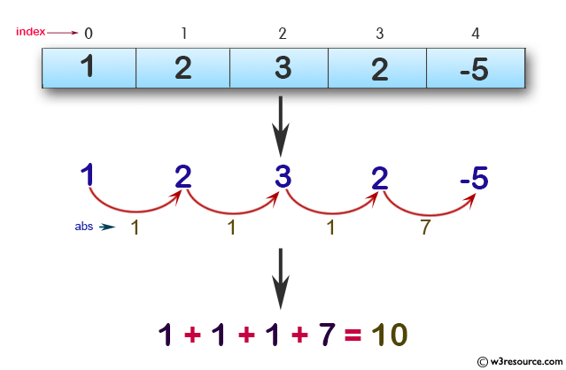  

97. Write a JavaScript program to find the shortest possible string which can create a string to make it a palindrome by adding characters to the end of it.

98. Write a JavaScript program to switch case of the minimum possible number of letters to make a given string written in the upper case or in the lower case.
> Fox example "Write" will be write and "PHp" will be "PHP"

99. Write a JavaScript program to check whether it is possible to rearrange characters of a given string in such way that it will become equal to another given string.

100. Write a JavaScript program to check if there is at least one element which occurs in two given sorted arrays of integers.

101. Write a JavaScript program to check whether a given string contains only Latin letters and no two uppercase and no two lowercase letters are in adjacent positions.

102. Write a JavaScript program to find the number of inversions of a given array of integers.
Note: Two elements of the array a stored at positions i and j form an inversion if a[i] > a[j] and i < j.

103. Write a JavaScript program to find the maximal number from a given positive integer by deleting exactly one digit of the given number.  
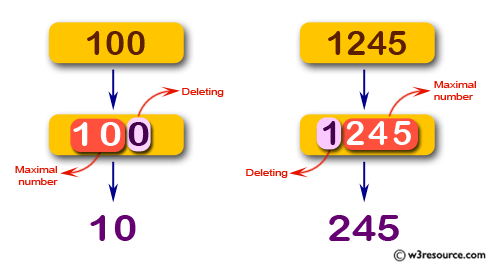  

104. Write a JavaScript program to find two elements of the array such that their absolute difference is not greater than a given integer but is as close to the said integer.

105. Write a JavaScript program to find the number of times to replace a given number with the sum of its digits until it convert to a single digit number.  
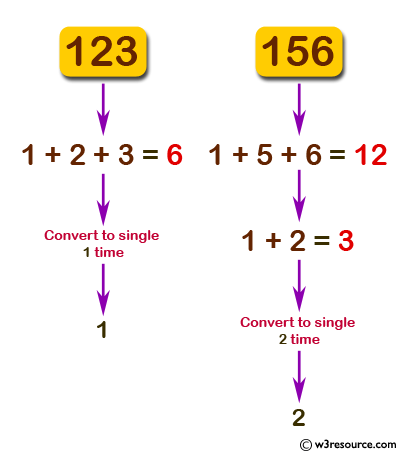  

106. Write a JavaScript program to divide an integer by another integer as long as the result is an integer and return the result.

107. Write a JavaScript program to find the number of sorted pairs formed by its elements of an given array of integers such that one element in the pair is divisible by the other one.
For example - The output of [1, 3, 2] ->2 - (1,3), (1,2).
The output of [2, 4, 6] -> 2 - (2,4), (2,6)
The output of [2, 4, 16] -> 3 - (2,4), (2,16), (4,16)

108. Write a JavaScript program to create the dot products of two given 3D vectors.
Note: The dot product is the sum of the products of the corresponding entries of the two sequences of numbers.

109. Write a JavaScript program to sort an array of all prime numbers between 1 and a given integer.

110. Write a JavaScript program to find the number of even values in sequence before the first occurrence of a given number.

111. Write a JavaScript program to check a number from three given numbers where two numbers are equal, find the third one.  
  

112. Write a JavaScript program to find the number of trailing zeros in the decimal representation of the factorial of a given number.

113. Write a JavaScript program to calculate the sum n + n/2 + n/4 + n/8 + .... where n is a positive integer and all divisions are integer.

114. Write a JavaScript program to check whether a given string represents a correct sentence or not. A string is considered correct sentence if it starts with the capital letter and ends with a full stop (.).

115. Write a JavaScript program to check whether a matrix is a diagonal matrix or not. In linear algebra, a diagonal matrix is a matrix in which the entries outside the main diagonal are all zero (the diagonal from the upper left to the lower right).
> Example:   
> ``[1, 0, 0], [0, 2, 0], [0, 0, 3] ]) = true``  
> ``[1, 0, 0], [0, 2, 3], [0, 0, 3] ]) = false``

116. Write a JavaScript program to find all the possible options to replace the hash in a string (Consists of digits and one hash (#)) with a digit to produce an integer divisible by 3.
> ``For a string "2*0", the output should be : ["210", "240", "270"]``

117. Write a JavaScript program to check if a given matrix is an identity matrix.
Note: In linear algebra, the identity matrix, or sometimes ambiguously called a unit matrix, of size n is the n ? n square matrix with ones on the main diagonal and zeros elsewhere.
> ``[[1, 0, 0], [0, 1, 0], [0, 0, 1]] -> true``  
> ``[[1, 0, 0], [0, 1, 0], [1, 0, 1]] -> false``

118. Write a JavaScript program to check if a given number is in a given range.

119. Write a JavaScript program to check if a given integer has an increasing digits sequence.

120. Write a JavaScript program to check if a point lies strictly inside a given circle.
> Input:   
> ``Center of the circle (x, y)``     
> ``Radius of circle: r``  
> ``Point inside a circle (a, b)``

121. Write a JavaScript program to check if a given matrix is lower triangular or not.
Note: A square matrix is called lower triangular if all the entries above the main diagonal are zero.

122. Write a JavaScript program to check whether a given array of integers represents either a strictly increasing or a strictly decreasing sequence.

123. Write a JavaScript program to find if the members of an given array of integers is a permutation of numbers from 1 to a given integer.

124. Write a JavaScript program to create the value of NOR of two given booleans.
> Note: In boolean logic, logical nor or joint denial is a truth-functional operator which produces a result that is the negation of logical or. That is, a sentence of the form (p NOR q) is true precisely when neither p nor q is true - i.e. when both of p and q are false  

> Sample Example:  
> ``For x = true and y = false, the output should be logical_Nor(x, y) = false;``  
> ``For x = false and y = false, the output should be logical_Nor(x, y) = true.``

125. Write a JavaScript program to find the longest string from a given array.

126. Write a JavaScript program to get the largest even number from an array of integers.

127. Write a JavaScript program to reverse the order of the bits in a given integer.
> 56 -> 111000 after reverse 7 -> 111  
> 234 -> 11101010 after reverse 87 -> 1010111  
  

128. Write a JavaScript program to find the smallest round number that is not less than a given value.
> Note: A round number is informally considered to be an integer that ends with one or more zeros.[3]
> So, 590 is rounder than 592, but 590 is less round than 600.  
  

129. Write a JavaScript program to find the smallest prime number strictly greater than a given number.

130. Write a JavaScript program to find the number of even digits in a given integer.
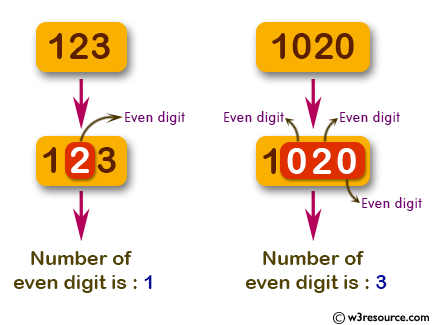  

131. Write a JavaScript program to create an array of prefix sums of the given array.
In computer science, the prefix sum, cumulative sum, inclusive scan, or simply scan of a sequence of numbers x0, x1, x2, ... is a second sequence of numbers y0, y1, y2, ..., the sums of prefixes of the input sequence:
> y0 = x0   
> y1 = x0 + x1  
> y2 = x0 + x1+ x2  
> ...

132. Write a JavaScript program to find all distinct prime factors of a given integer.
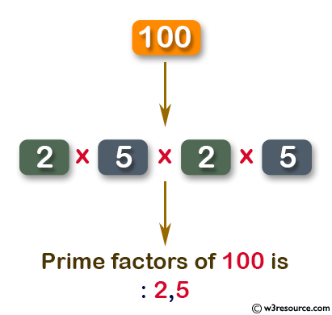  

133. Write a JavaScript program to check whether a given fraction is proper or not.
> Note: There are two types of common fractions, proper or improper. When the numerator and the denominator are both positive, the fraction is called proper if the numerator is less than the denominator, and improper otherwise.

134. Write a JavaScript program to change the characters (lower case) in a string where a turns into z, b turns into y, c turns into x, ..., n turns into m, m turns into n, ..., z turns into a.

135. Write a JavaScript program to remove all characters from a given string that appear more than once.

136. Write a JavaScript program to replace the first digit in a string (should contains at least digit) with $ character.

137. Write a JavaScript program to test if a given integer is greater than 15 return the given number, otherwise return 15.

138. Write a JavaScript program to reverse the bits of a given 16 bits unsigned short integer.

139. Write a JavaScript program to find the position of a rightmost round number in an array of integers. Returns 0 if there are no round number.
> Note: A round number is informally considered to be an integer that ends with one or more zeros.  
  

140. Write a JavaScript program to check if all the digits in a given number are the same or not.

141. Write a JavaScript program to find the number of elements which presents in both of the given arrays.

142. Write a JavaScript program to simplify a given absolute path for a file in Unix-style.

143. Write a JavaScript program to sort the strings of a given array of strings in the order of increasing lengths.
> Note: Do not change the order if the lengths of two string are same.

144. Write a JavaScript program to break an address of an url and put it's part into an array.
> Note: url structure : ://.org[/] and there may be no part in the address.  
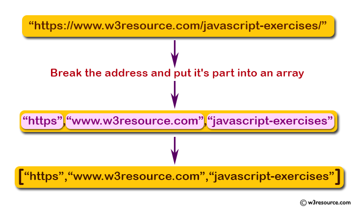  

145. Write a JavaScript program to find the maximum integer n such that 1 + 2 + ... + n <= an given integer.

146. Write a JavaScript program to compute the sum of cubes of all integer from 1 to a given integer.

147. Write a JavaScript program to compute the sum of all digits that occur in a given string.
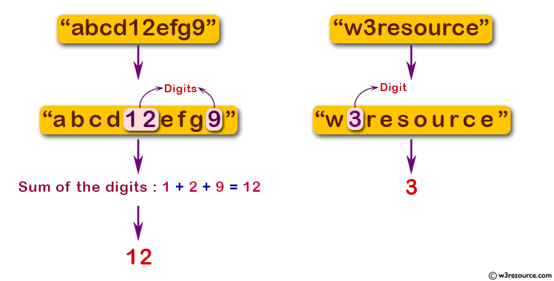  

148. Write a JavaScript program to swap two halves of a given array of integers of even length.
  

149. Write a JavaScript program to change the capitalization of all letters in a given string.

150. Write a JavaScript program to swap pairs of adjacent digits of a given integer of even length.
  
